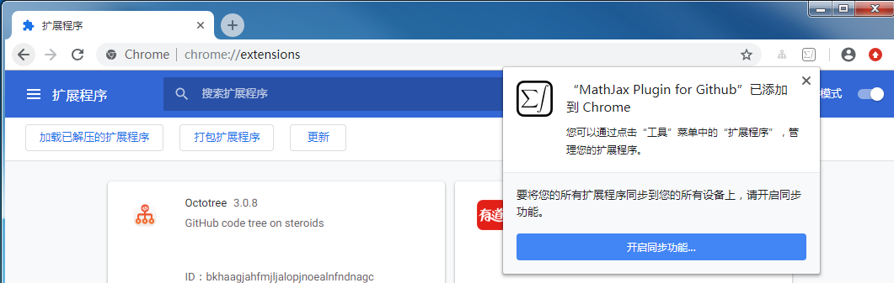

# MathJax Plugin for Github的下载与安装

1. 谷歌应用商店在线安装

   打开网页：https://chrome.google.com/webstore/detail/mathjax-plugin-for-github/ioemnmodlmafdkllaclgeombjnmnbima

   点击“添加至Chrome” 

   

   

   出现对话框询问是否添加该插件，点击对话框的“添加扩展程序”按钮

   

   

   提示插件已添加到Chrome，则可正常使用了。

   

   

   

   首选这个方法，如果该网址无法访问，则采用下面第2个方法。

   

2. 从本仓库下载插件MathJax_Plugin_for_Github_0_2_4_0.crx到本地，离线安装

   （1）下载本仓库的文件MathJax_Plugin_for_Github_0_2_4_0.crx，保存到本地磁盘。

   （2）在浏览器地址栏输入chrome://extensions

   进入扩展程序页面，启用“开发者模式”

   

   （3）用鼠标拖动文件MathJax_Plugin_for_Github_0_2_4_0.crx到浏览器扩展程序页面，出现提示对话框询问是否添加该插件。点击对话框的“添加扩展程序”按钮。

   

   

   提示插件已添加到Chrome，则可正常使用了。

   

   
